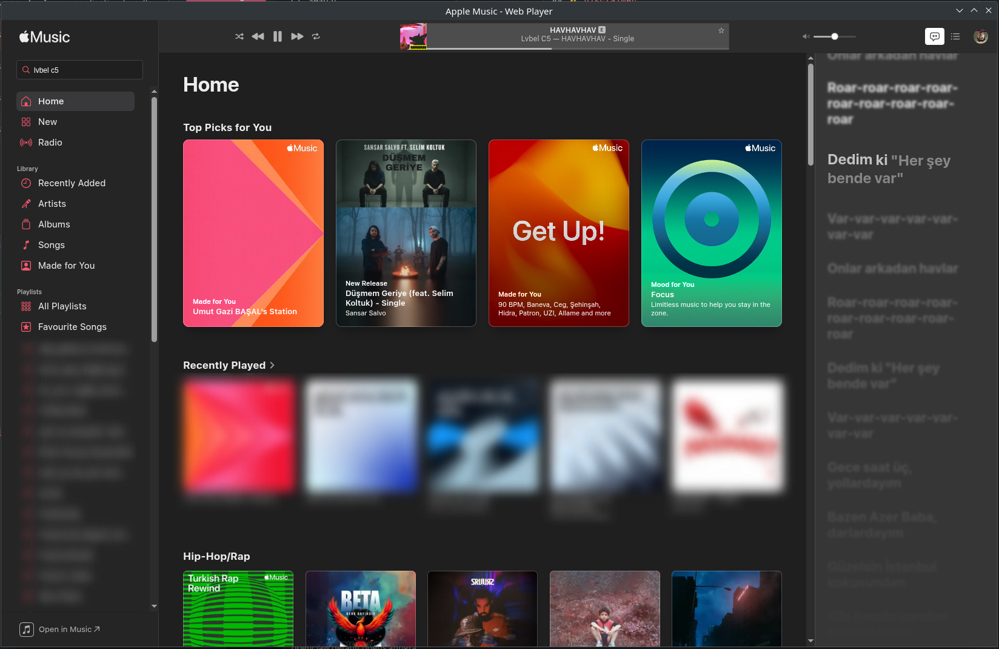

<div align="center">

# 🎵 Apple Music for Linux

**The missing Apple Music client for Linux**

[](https://github.com/basalumutgazi/apple-music-linux/releases)
[](https://opensource.org/licenses/MIT)
[](https://github.com/basalumutgazi/apple-music-linux/releases)

[Download](#installation) • [Features](#features) • [Screenshots](#screenshots) • [Contributing](#contributing)

</div>

---

## 🎧 Why Apple Music Linux?

Tired of using Apple Music in a browser tab? This native-like Electron wrapper gives you:

- **Full playback** - Not just 30-second previews, full songs with Widevine DRM
- **System integration** - Media keys, playerctl, and MPRIS support work out of the box
- **Lightweight** - Minimal resource usage compared to running a full browser
- **Open source** - Free forever, community-driven

## ✨ Features

| Feature | Status |
|---------|--------|
| Full song playback | ✅ |
| Widevine DRM support | ✅ |
| System media controls | ✅ |
| Keyboard media keys | ✅ |
| Desktop notifications | ✅ |
| AppImage & .deb packages | ✅ |
| Auto-updates | 🔜 |
| Lyrics display | 🔜 |

## 📸 Screenshots

<div align="center">

</div>

## 📦 Installation

### Option 1: AppImage (Recommended)
```bash
# Download
wget https://github.com/basalumutgazi/apple-music-linux/releases/latest/download/Apple.Music-1.0.0.AppImage

# Make executable
chmod +x Apple.Music-1.0.0.AppImage

# Run
./Apple.Music-1.0.0.AppImage
```

### Option 2: Debian/Ubuntu (.deb)
```bash
wget https://github.com/basalumutgazi/apple-music-linux/releases/download/v1.0.0/apple-music-linux_1.0.0_amd64.deb
sudo dpkg -i apple-music-linux_1.0.0_amd64.deb
```

### Option 3: Quick Install Script
```bash
curl -fsSL https://raw.githubusercontent.com/basalumutgazi/apple-music-linux/main/install.sh | bash
```

### Option 4: Build from Source

<details>
<summary>Click to expand</summary>
```bash
git clone https://github.com/basalumutgazi/apple-music-linux.git
cd apple-music-linux
npm install

# Download Castlabs Electron (Widevine support)
wget https://github.com/castlabs/electron-releases/releases/download/v40.1.0%2Bwvcus/electron-v40.1.0+wvcus-linux-x64.zip
mkdir -p node_modules/electron/dist
unzip electron-v40.1.0+wvcus-linux-x64.zip -d node_modules/electron/dist/

# Fix sandbox permissions
sudo chown root:root node_modules/electron/dist/chrome-sandbox
sudo chmod 4755 node_modules/electron/dist/chrome-sandbox

# Run
npm start
```

</details>

## ⌨️ Keyboard Shortcuts

| Shortcut | Action |
|----------|--------|
| `Space` | Play/Pause |
| `→` | Next track |
| `←` | Previous track |
| `↑` | Volume up |
| `↓` | Volume down |

## 🔧 Requirements

- Linux x64 (Ubuntu, Fedora, Arch, etc.)
- Apple Music subscription

## 🤝 Contributing

Contributions are welcome! Feel free to:

- 🐛 Report bugs
- 💡 Suggest features
- 🔧 Submit pull requests

## 📄 License

MIT © [basalumutgazi](https://github.com/basalumutgazi)

## ⚠️ Disclaimer

This is an unofficial client and is not affiliated with, endorsed by, or connected to Apple Inc.

---

<div align="center">

**If you find this useful, consider giving it a ⭐**

</div>
